>> ### Esame di telerilevamento geo-ecologico in R 2026
> > Benito De Gennaro mat. 1218365

# Analisi tramite telerilevamento degli effetti del conflitto armato sull'ambiente in Ucraina 🛰️       
### 🌱 Monitoraggio della salute vegetativa tramite indici spettrali
### 🗓️ Periodo di studio: 2021-2026
---
# 📕 Introduzione 
Il progetto si propone di analizzare gli effetti ambientali del conflitto armato nella regione di **Charkiv (area di Izjum)**, un territorio storicamente caratterizzato da suoli altamente fertili e da un'intensa vocazione agricola. Le ostilità in quest'area hanno innescato severi processi di degrado fisico ed ecologico, riconducibili principalmente all'abbandono prolungato delle pratiche colturali, al passaggio di mezzi pesanti e agli incendi causati dalle esplosioni. 
Attraverso l'impiego delle immagini satellitari di Sentinel-2 (programma Copernicus), è stato possibile osservare le dinamiche di trasformazione del territorio nell'arco temporale 2021-2026. L'analisi si è articolata in tre momenti chiave:
- **2021** (Baseline): rappresenta il territorio in condizioni di normalità.... Attraverso l'impiego delle immagini satellitari di Sentinel-2 (programma Copernicus), è stato possibile osservare le dinamiche di trasformazione del territorio nell'arco temporale 2021-2026. L'analisi si è articolata in tre momenti chiave:
- **2021** (Baseline): rappresenta il territorio in condizioni di normalità, prima dell'escalation del conflitto.
- **2022** (Fase critica): evidenzia l'impatto diretto delle attività belliche sulla copertura del suolo e sulla salute della vegetazione.
- **2026** (Situazione attuale): permette di valutare il grado di ripristino dell'ecosistema o, al contrario, la persistenza dei danni ambientali nel tempo.
  


# 📌Obiettivi
L'obiettivo è quantificare l'impatto bellico, non solo attraverso un'analisi qualitativa (composizioni RGB), ma anche mediante l'elaborazione quantitativa di indici di vegetazione: Difference Vegetation Index (DVI) e Normalized Difference Vegetation Index (NDVI). L'analisi multitemorale 2021-2026 permette inoltre, di indagare la resilienza dell'ecosistema in un'area soggetta a pressioni antropiche estreme.

# 🛠️Materiali e metodi 
## Acquisizione dati 
Le immagini sono state acquisite dal portale web di [Google Earth Engine](https://earthengine.google.com/), selezionando una delle aree colpite nel conflitto.
## Caratteristiche del sensore (sentinel 2) 
Per l'analisi è stato utilizzato il satellite Sentinel-2 (programma Copernicus), scelto per le sue caratteristiche tecniche:
- **Risoluzione spaziale**: 10 metri nelle bande del visibile e nel NIR, essenziale per il dettaglio agrario.
- **Risoluzione temporale**: Alta frequenza di rivisitazione, ideale per serie storiche multitemporali (2021-2026).
- **Bande spettrali**: Presenza delle bande NIR e SWIR, necessarie per il calcolo preciso degli indici NDVI e NBR.

| Banda | Nome Comune |
| :---: | :--- |
| **B2** | Blu |
| **B3** | Verde |
| **B4** | Rosso |
| **B8** | Vicino Infrarosso (NIR) |
| **B11** | Infrarosso a onde corte (SWIR 1) |


>[!NOTE]
>
> Il codice JavaScript utilizzato per l'acquisizione delle immagini è disponibile nel file code.js.

## Inizio dell'analisi tramite il software R 


````r
# Impostazione della cartella di lavoro del progetto
setwd("~/Desktop/Progetto_ucraina.R")

# Verifica del percorso corrente
getwd()

# Verifica dei file disponibili nella directory
list.files()
````
Caricamento dei pacchetti che verranno utilizzati nello studio.
````r
library(terra)     # Per la gestione di dati raster. 
library(imageRy)   # Gestione, analisi e visualizzazione multiframe di immagini raster
library(ggplot2)   # Creazione di grafici statici basata sulla Grammatica della Grafica
library(patchwork) # Combinazione e composizione flessibile di più grafici
library(viridis)   # Palette di colori ad alta leggibilità per daltonici
library(ggridges)  # Grafici a cresta (ridgeline) per visualizzare distribuzioni continue
````
## Importazione dei dati 
Carico i dati raster acquisiti da Sentinel-2.
````r
Ucraina_2021<-rast("Ucraina_2021_bands.tif") # dati pre-conflitto (2021)
Ucraina_2022<-rast("Ucraina_2022_bands.tif") # Dati fase intermedia (2022)
Ucraina_2026<-rast("Ucraina_2026_bands.tif") # Dati correnti (2026)
````

## Verifica dei metadati dei dati raster caricati 

Prima di procedere con l'elaborazione, interrogo i tre oggetti ````Ucraina_2021````, ````Ucraina_2022````e ```` Ucraina_2026````per validare le loro proprietà spaziali e strutturali. Questo passaggio è necessario per confermare che i dati siano correttamente allineati e pronti per l'analisi comparativa. In particolare, verifico:

- **Dimensioni**:Risoluzione spaziale e numero di pixel.
- **Bande**:Numero e tipologia di bande spettrali disponibili.
- **Sistema di riferimento** Fondamentale per garantire la sovrapponibilità geografica dei layer.
- **Estensione** Coordinate dei limiti dell'area di studio.

````r
# Verifica dei metadati e delle proprietà spaziali dei dataset (2021, 2022, 2026)
Ucraina_2021
Ucraina_2022
Ucraina_2026
````
Dall'interrogazione degli oggetti, risulta che tutti e tre i dataset presentano le medesime caratteristiche strutturali, nello specifico:
- la classe : SpatRaster
- la dimensione : 3118, 4454, 5 
- la risoluzione : 8.983153e-05, 8.983153e-05
- l'estensione : 37.19995, 37.60006, 48.97992, 49.26002
- il sistema di riferimento : WGS 84 (EPSG:4326)
- le bande : B2, B3, B4, B8, B11

## Visualizzazione delle immagini 
**2021**
````r
#visualizzazione delle bande spettrali (2021)
plot(Ucraina_2021)
````
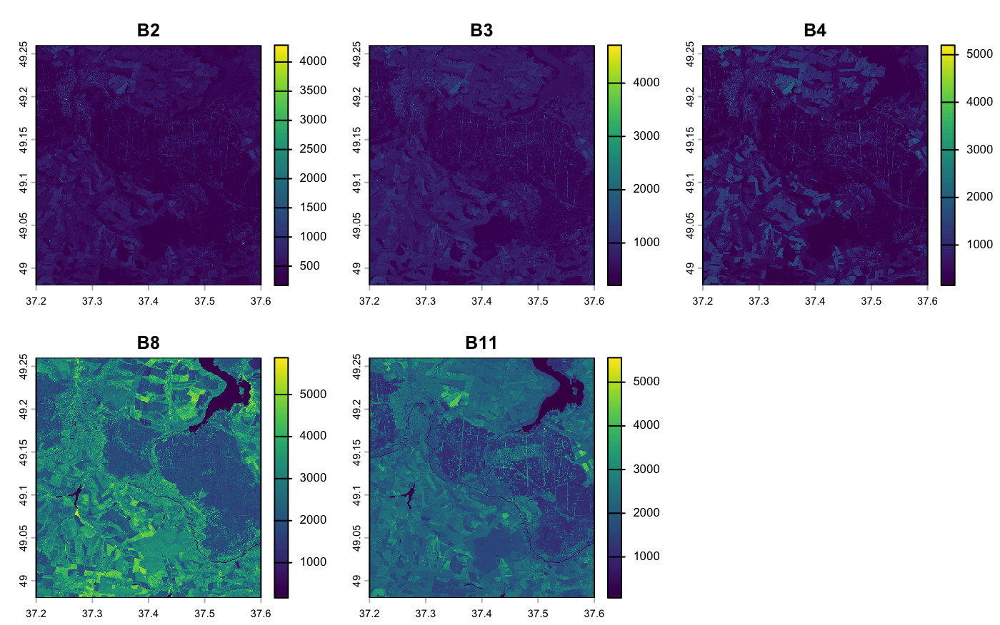

**2022**
````r
#visualizzazione delle bande spettrali (2022)
plot(Ucraina_2022)
````
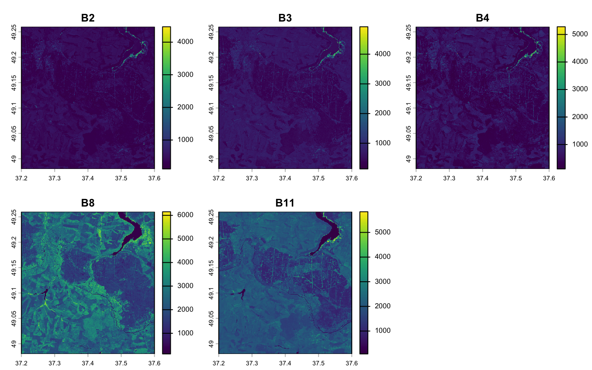

**2026**
````r
#visualizzazione delle bande spettrali (2026)
plot(Ucraina_2026)
````
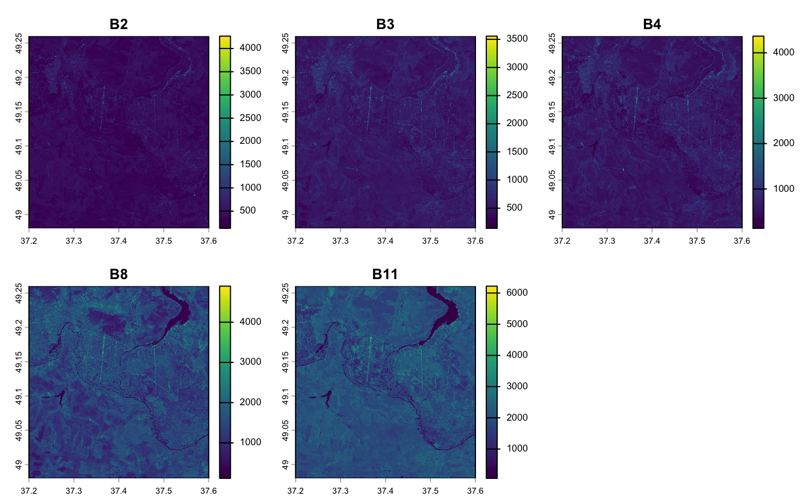

## Composizione in Colori Naturali (True Color)
````r
# Configurazione dello schermo su 1 riga e 3 colonne
im.multiframe(1,3)

# Visualizzazione in colori naturali (RGB 3,2,1) per il confronto temporale (2021, 2022,2026)
im.plotRGB(Ucraina_2021, r=3, g=2, b=1, title="Ucraina 2021 pre-conflitto")
im.plotRGB(Ucraina_2022, r=3, g=2, b=1, title="Ucraina 2022 periodo critico")
im.plotRGB(Ucraina_2026, r=3, g=2, b=1, title="Ucraina 2026 periodo attuale")
````
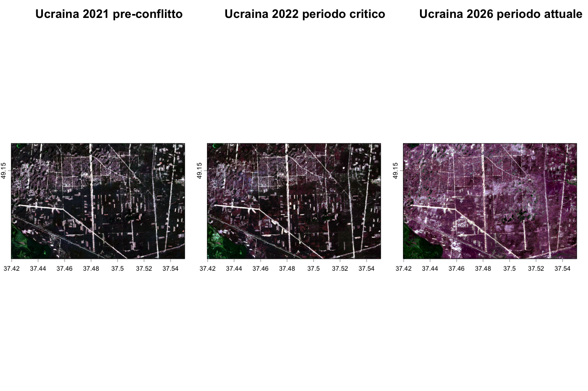

La serie multitemporale analizzata consente di visualizzare i processi di degradazione del suolo in funzione dell'escalation del conflitto.Nel 2021 si osserva la normale alternanza tra campi agricoli e aree boscate. A partire dal 2022, e in modo più evidente nel 2026, si nota una destrutturazione geometrica delle trame agricole e una variazione tonale diffusa, legata all'abbandono delle colture e ai danni diretti al soprassuolo causati dagli eventi bellici.


## Analisi della scomposizione spettrale multitemporale
Attraverso il confronto tra le bande del visibile (B2, B3, B4) e la banda del vicino infrarosso (B8), è possibile isolare la risposta riflettiva del suolo e della vegetazione in tre differenti fasi temporali: baseline (2021), fase critica (2022) e situazione attuale (2026).

````r
# Configurazione dello schermo su 3 righe e 4 colonne
im.multiframe(3, 4) 

# Visualizzazione delle singole bande (B2=Blu, B3=Verde, B4=Rosso, B8=NIR) con palette cividis
# Anno 2021
plot(Ucraina_2021[[1]], col=cividis(100), main="2021 - B2") 
plot(Ucraina_2021[[2]], col=cividis(100), main="2021 - B3") 
plot(Ucraina_2021[[3]], col=cividis(100), main="2021 - B4") 
plot(Ucraina_2021[[4]], col=cividis(100), main="2021 - B8") 

# Anno 2022
plot(Ucraina_2022[[1]], col=cividis(100), main="2022 - B2") 
plot(Ucraina_2022[[2]], col=cividis(100), main="2022 - B3") 
plot(Ucraina_2022[[3]], col=cividis(100), main="2022 - B4") 
plot(Ucraina_2022[[4]], col=cividis(100), main="2022 - B8") 

# Anno 2026
plot(Ucraina_2026[[1]], col=cividis(100), main="2026 - B2") 
plot(Ucraina_2026[[2]], col=cividis(100), main="2026 - B3") 
plot(Ucraina_2026[[3]], col=cividis(100), main="2026 - B4") 
plot(Ucraina_2026[[4]], col=cividis(100), main="2026 - B8")
````
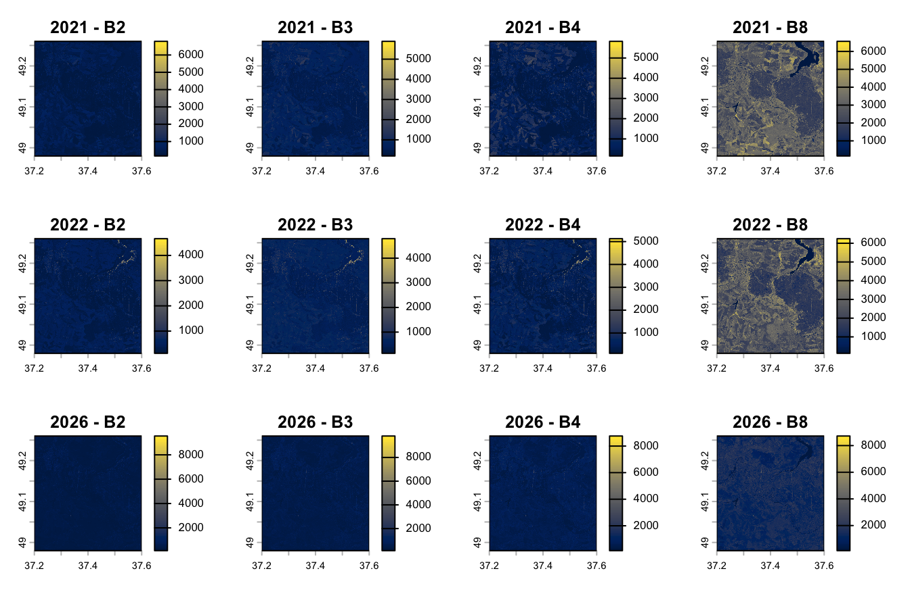

Dall'osservazione delle immagini emerge una netta variazione nella banda del vicino infrarosso (B8), dove la perdita di riflettanza tra il 2021 e il 2026 evidenzia una significativa distruzione della copertura vegetale. 
- Nel **2021** la presenza di pixel gialli nella banda (B8) indica una elevata riflettanza nel vicino infrarosso, caratteristica tipica di una vegetazione sana e vigorosa
- ⁠Nel **2022** i toni chiari iniziano ad attenuarsi, indicando un primo calo della riflettanza
- ⁠Nel **2026** l'immagine diventa molto scura questa massiccia perdita di riflettanza nel vicino infrarosso documenta una quasi totale perdita di vegetazione

## 🌾 Calcolo degli indici vegetazionali 

### Different vegetation index (DVI) 
Il DVI, viene utilizzato per valutare la presenza di vegetazione. Il DVI sfrutta la differente risposta spettrale della vegetazione nelle bande del vicino infrarosso **(NIR)** e del rosso **(RED)**. Le piante sane assorbono gran parte della radiazione nella banda del rosso per i processi fotosintetici e riflettono intensamente la radiazione nel vicino infrarosso. Di conseguenza, la differenza tra queste due bande consente di stimare la presenza e la vigoria della copertura vegetale.

$` DVI = NIR - RED `$   
````r
# Calcolo del Difference Vegetation Index (DVI) utilizzando la banda 4 (NIR) e la banda 3 (Rosso)
dvi_2021 <- im.dvi(Ucraina_2021, 4, 3)
dvi_2022 <- im.dvi(Ucraina_2022, 4, 3)
dvi_2026 <- im.dvi(Ucraina_2026, 4, 3)
````
Tramite la visualizzazione delle carte prodotte, è possibile apprezzare la variazione temporale della biomassa e identificare chiaramente le aree colpite dal degrado ambientale

````R
# Configurazione dello schermo su 1 riga e 3 colonne
im.multiframe(1, 3) 

# Visualizzazione dell'indice DVI con palette inferno per il confronto temporale
plot(dvi_2021, col=inferno(100), main="DVI 2021") 
plot(dvi_2022, col=inferno(100), main="DVI 2022") 
plot(dvi_2026, col=inferno(100), main="DVI 2026")
````
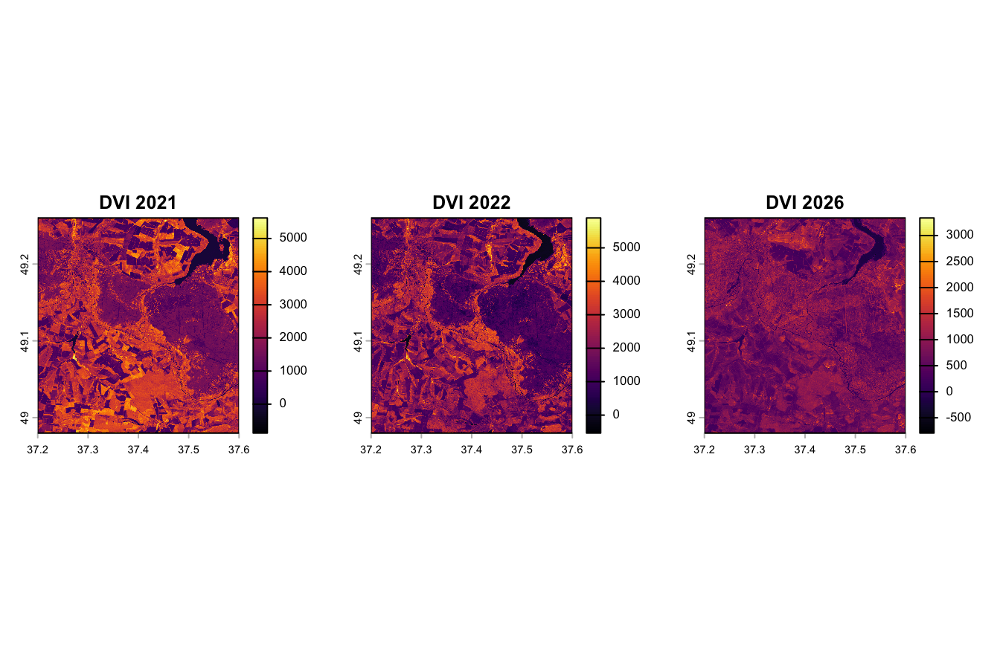

Dal confronto del DVI si può osservare un progressivo e drastico calo del vigore vegetativo, rilevando una forte diminuzione di biomassa nel 2022, processo che appare ulteriormente accentuato nel 2026.
Osservando le scale si può notare come i valori nel 2021 e 2022 siano superiori a 5000, mentre nel 2026 la scala si contrae fino a un valore di 3500 e compaiono valori negativi, indice di suolo completamente nudo e degradato.

### Normalized Difference Vegetation Index (NDVI)
Il *Normalized Difference Vegetation Index*  si utilizza per valutare lo stato di salute e la densità di copertura vegetale. L'indice NDVI analogamente all'indice DVI sfrutta la differente risposta spettrale della vegetazione nelle bande del rosso (Red) e del vicino infrarosso (NIR). Tuttavia grazie alla normalizzazione l'NDVI assume valori compresi tra -1 e +1, facilitando il confronto tra immagini acquisite in periodi differenti. 

$NDVI = \frac{NIR - Red}{NIR + Red}$

- Valori prossimi a +1 indicano vegetazione sana e vigorosa
- Valori vicini allo 0 indicano vegetazione rada
- Valori negativi sono generalmente associati a superfici d'acqua, aree urbanizzate o suoli privi di vegetazione.

````r
# Calcolo del Normalized Difference Vegetation Index (NDVI) tramite bande 4 (NIR) e 3 (Rosso)
ndvi_2021 <- im.ndvi(Ucraina_2021, 4, 3)
ndvi_2022 <- im.ndvi(Ucraina_2022, 4, 3)
ndvi_2026 <- im.ndvi(Ucraina_2026, 4, 3)
````
La distribuzione spaziale del vigore fotosintetico calcolato viene visualizzata di seguito.

````r
# Configurazione dello schermo su 1 riga e 3 colonne
im.multiframe(1, 3) 

# Visualizzazione dell'indice NDVI con palette mako per il confronto temporale
plot(ndvi_2021, col=mako(100), main="NDVI 2021") 
plot(ndvi_2022, col=mako(100), main="NDVI 2022") 
plot(ndvi_2026, col=mako(100), main="NDVI 2026")
````
Il confronto multitemporale delle mappe di NDVI mostra una progressiva diminuzione dei valori dell'indice a partire dal 2022, indicativa di una significativa riduzione del vigore vegetativo durante la fase più intensa del conflitto. Tale fenomeno di degrado non manifesta segni di ripresa, evidenziando un ulteriore e progressivo peggioramento nel 2026.

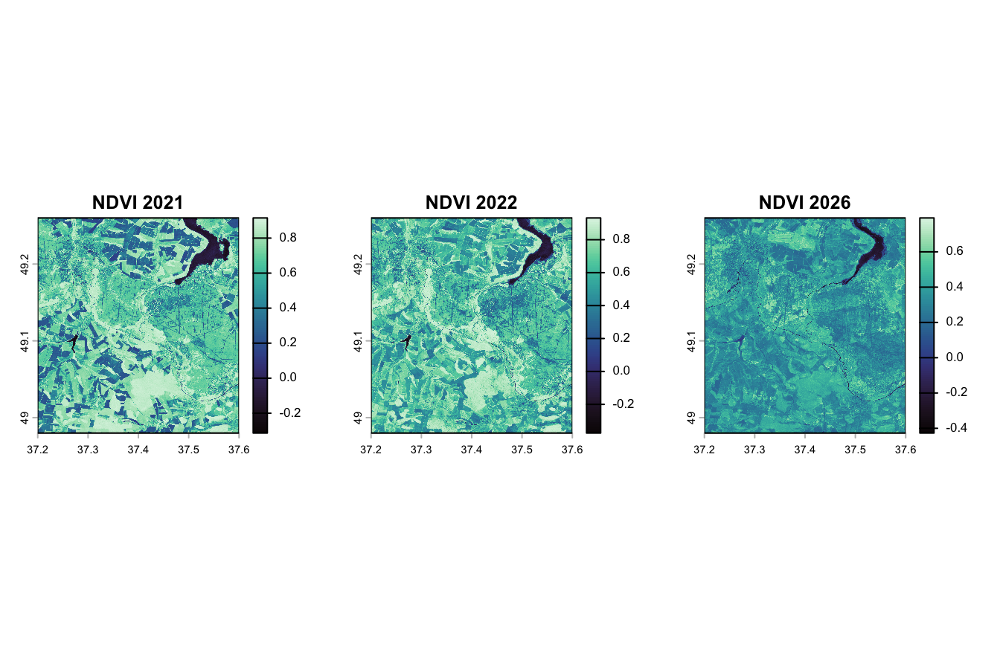

### Calcolo della differenza multitemporale dell'NDVI
Per analizzare l'evoluzione temporale dell'area di studio, viene calcolata la differenza tra NDVI, permettendo di mappare il gradiente di variazione del vigore vegetativo, dove i valori negativi evidenziano i processi di degrado ambientale avvenuti negli anni.

````r
# Calcolo delle differenze temporali dell'NDVI tra i diversi periodi
dif_22_21 <- ndvi_2022 - ndvi_2021 
dif_26_22 <- ndvi_2026 - ndvi_2022 
dif_26_21 <- ndvi_2026 - ndvi_2021

# Configurazione dello schermo su 1 riga e 3 colonne
im.multiframe(1, 3)

# Visualizzazione delle variazioni di NDVI con palette inferno
plot(dif_22_21, col=inferno(100), main="dif_NDVI_2022-2021") 
plot(dif_26_22, col=inferno(100), main="dif_NDVI_2026-2022") 
plot(dif_26_21, col=inferno(100), main="dif_NDVI_2026-2021")
````
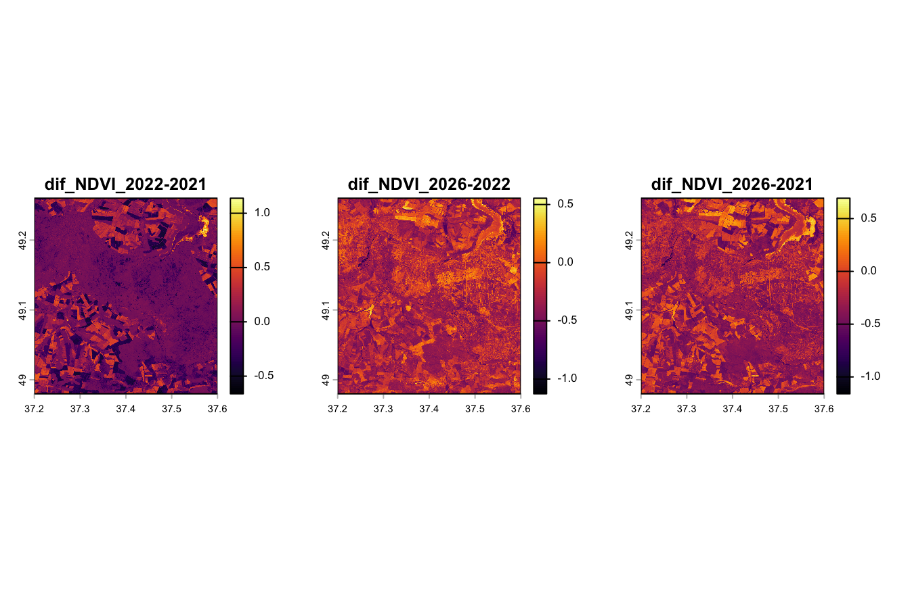  
Le mappe di differenza evidenziano una forte variazione spaziale. Nella prima fase (2021-2022) i valori variano tra +1.0 e -0.5, mostrando una situazione ancora parzialmente stabile. Nelle mappe successive, che includono il 2026, la scala dei valori si sposta verso il basso, variando tra +0.5 e -1.0; la diffusione delle tonalità scure e arancioni documenta il calo generalizzato dell'NDVI e l'estensione del degrado ambientale.

### Analisi statistica della densità di distribuzione dell'NDVI
Al fine di poter valutare quantitativamente le variazioni spaziali osservate nei cartogrammi dell'NDVI e nelle relative mappe differenziali, viene utilizzata l'analisi statistica della distribuzione dei valori dei pixel per ciascun anno. A tale scopo, viene utilizzato il grafico a cresta (ridgeline plot), uno strumento specifico per il confronto multitemporale immediato della densità dei dati. Per osservare la variazione temporale continua in un unico grafico, i singoli layer raster dell'NDVI vengono uniti in uno stack.

````r
# Creazione dello stack dei layer NDVI e assegnazione dei relativi nomi
ndvi_stack <- c(ndvi_2021, ndvi_2022, ndvi_2026)
names(ndvi_stack) <- c("NDVI_2021", "NDVI_2022", "NDVI_2026")

# Generazione del ridgeline plot per il confronto delle distribuzioni con palette inferno
im.ridgeline(ndvi_stack, scale=1, palette="inferno")
````
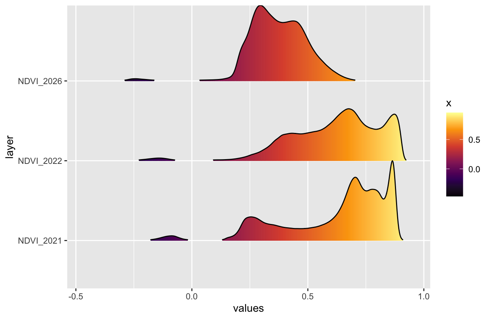  

Il grafico mostra chiaramente l'evoluzione temporale della distribuzione dell'NDVI per gli anni 2021, 2022 e 2026.
Il grafico evidenzia: 

- **2021**: la distribuzione è sbilanciata verso destra con un picco acuto verso lo 0.9, indicando una forte prevalenza di vegetazione densa.
- **2022**: si individua uno spostamento della massa verso valori intorno a 0.7 con una parziale riduzione del picco massimo di vigore rispetto al 2021.
- **2026**: La distribuzione subisce una contrazione drastica e un netto spostamento verso sinistra. Il picco si sposta verso valori dello 0.3, con una scomparsa di valori >0.7 (componente di vegetazione ad alto vigore).

## Classificazione 
Tramite la classificazione è possibile stabilire la frequenza dei pixel della copertura vegetale e di quella del suolo nudo. Per questo studio è stata scelta una classificazione a due classi.

````r
# Classificazione non supervisionata in 2 cluster (es. vegetazione e suolo nudo)
class_2021 <- im.classify(ndvi_2021, seed=42, num_clusters=2)
class_2022 <- im.classify(ndvi_2022, seed=42, num_clusters=2)
class_2026 <- im.classify(ndvi_2026, seed=42, num_clusters=2)
````
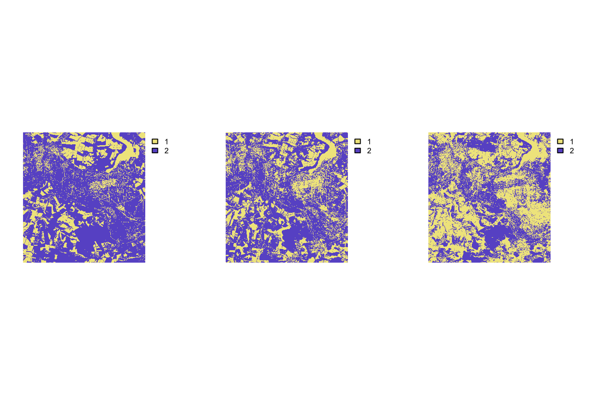

````r
# Definizione della legenda a due classi (valori basati sull'ordine dei cluster generati)
levels(class_2021) <- data.frame(value = c(2, 1), label = c("vegetazione", "suolo nudo"))
levels(class_2022) <- data.frame(value = c(2, 1), label = c("vegetazione", "suolo nudo"))
levels(class_2026) <- data.frame(value = c(2, 1), label = c("vegetazione", "suolo nudo"))

# Configurazione dello schermo su 1 riga e 3 colonne
im.multiframe(1, 3)

# Visualizzazione delle mappe classificate per il confronto temporale
plot(class_2021, main="2021")
plot(class_2022, main="2022")
plot(class_2026, main="2026")
````
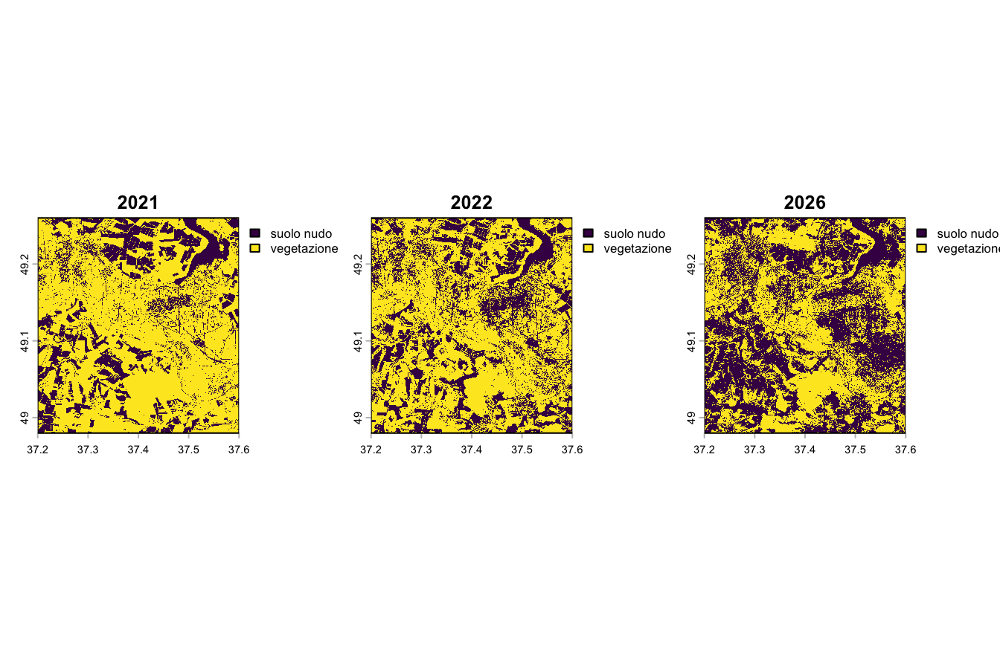
Al fine di validare quantitativamente le variazioni spaziali osservate nei cartogrami, vengono calcolate le frequenze percentuali sei pixel per ciascuna classe nei tre anni considerati.Dal confronto visivo delle mappe si rileva una progressiva e marcata espansione delle aree classificate come suolo nudo (in viola) a scapito della copertura vegetale (in giallo), fenomeno che trova riscontro analitico nel calcolo delle frequenze.

````r
# Calcolo della frequenza assoluta dei pixel per ciascuna classe
f2021 <- freq(class_2021) 
f2022 <- freq(class_2022) 
f2026 <- freq(class_2026) 

# Calcolo della proporzione (frequenza relativa) rispetto al numero totale di celle
prop2021 <- f2021$count / ncell(class_2021) 
prop2022 <- f2022$count / ncell(class_2022) 
prop2026 <- f2026$count / ncell(class_2026) 

# Conversione delle proporzioni in valori percentuali
perc2021 <- prop2021 * 100 
perc2022 <- prop2022 * 100 
perc2026 <- prop2026 * 100
````
Per una visualizzazione diretta viene generata una tabella.

````r
# Creazione del dataframe riassuntivo con le percentuali di suolo nudo e vegetazione per ogni anno
tabella <- data.frame(
  class = c("suolo nudo", "vegetazione"),
  percentuale_2021 = perc2021,
  percentuale_2022 = perc2022,
  percentuale_2026 = perc2026
)

# Visualizzazione della tabella finale
tabella
````
| class | percentuale_2021 | percentuale_2022 | percentuale_2026 |
| :--- | :---: | :---: | :---: |
| **suolo nudo** | 27.64959 | 35.74551 | 51.67242 |
| **vegetazione** | 72.35041 | 64.25449 | 48.32796 |

Come si può vedere dai dati ottenuti la vegetazione ha avuto un forte calo di circa l' 8% nel 2022 a causa del conflitto  con un ulteriore calo nel 2026 con un valore di circa del 24% rispetto al 2021.
Con i dati forniti dalla tabella prodotta vengono generati tre grafici a barre.

````r
# Generazione dei grafici a barre per il confronto della copertura percentuale negli anni (2021, 2022, 2026)
p1 <- ggplot(tabella, aes(x=class, y=percentuale_2021, color=class)) + 
  geom_bar(stat="identity", fill="white") + 
  ylim(c(0,100)) + 
  labs(title="Copertura 2021", x="Classe", y="Percentuale (%)") +
  theme(legend.position="none")

p2 <- ggplot(tabella, aes(x=class, y=percentuale_2022, color=class)) + 
  geom_bar(stat="identity", fill="white") + 
  ylim(c(0,100)) + 
  labs(title="Copertura 2022", x="Classe", y="Percentuale (%)") +
  theme(legend.position="none")

p3 <- ggplot(tabella, aes(x=class, y=percentuale_2026, color=class)) + 
  geom_bar(stat="identity", fill="white") + 
  ylim(c(0,100)) + 
  labs(title="Copertura 2026", x="Classe", y="Percentuale (%)") +
  theme(legend.position="none")

# Visualizzazione a schermo dei grafici affiancati
p1 + p2 + p3
````
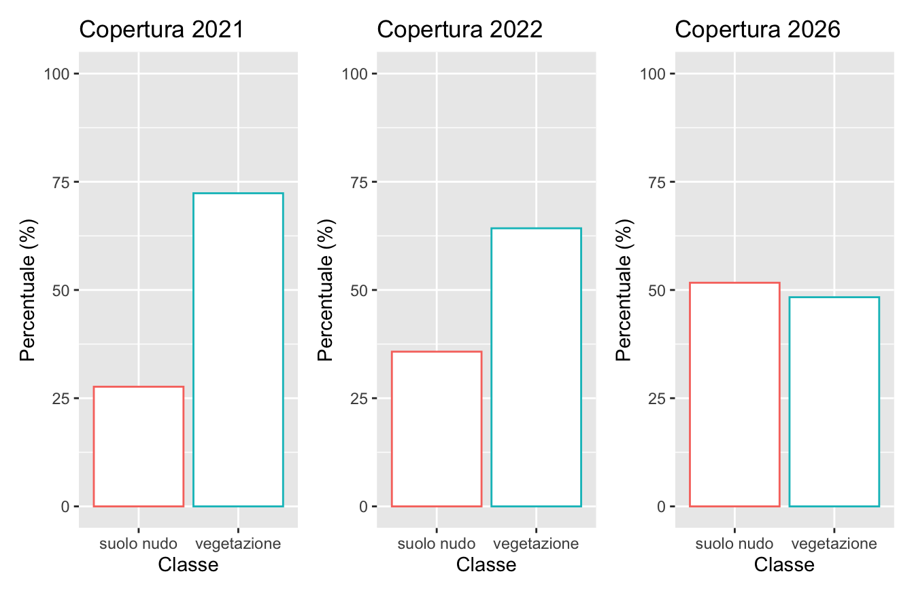

# Conclusioni 
Lo studio condotto tramite telerilevamento satellitare multitemporale ha permesso di quantificare e confrontare l'evoluzione del danno ambientale nell'area di studio tra il 2021 e il 2026. L'integrazione degli indici spettrali (DVI e NDVI), dell'analisi statistica della densità dei pixel mediante ridgeline plot e della classificazione finale ha evidenziato un processo di degrado continuo e cumulativo del territorio.
I risultati analitici mostrano che i danni non sono riconducibili esclusivamente al periodo iniziale del conflitto nel 2022, ma che essi risultano associati a una significativa e progressiva diminuzione della biomassa fotosinteticamente attiva. Nel 2026 il suolo nudo è diventato la matrice dominante con una copertura di circa il 51,67% del totale, mentre la vegetazione è scesa a una copertura di circa il 48,33%, confermando i gravi impatti ecologici in atto nel territorio ucraino.

# 🌐 Sitografia 
## Contesto storico e geopolitico 
"Kharkiv, la città martire sotto il tiro dei razzi: 'Ma resisteremo'" (2 marzo 2022). Articolo giornalistico che documenta l'inizio dell'offensiva militare e i bombardamenti sistematici nella regione di Kharkiv. L'intensificarsi delle ostilità sul territorio ha determinato il progressivo abbandono delle attività agricole e la conseguente alterazione della copertura vegetale nell'area di studio. Disponibile al link: https://www.repubblica.it/esteri/2022/03/02/news/kharkiv_la_citta_martire_sotto_il_tiro_dei_razzi_ma_resisteremo-339910718/
### Piattaforme dati e librerie software
- **Google Earth Engine:** https://earthengine.google.com/ (Piattaforma cloud per il pre-processing e l'estrazione dei dati raster).
- **CRAN Repository:** https://cran.r-project.org/ (Documentazione ufficiale dei pacchetti R utilizzati: `terra`, `ggplot2`, `ggridges`, `viridis`,`imageRy`, `patchwork`).
- **Copernicus Data Space Ecosystem:** https://dataspace.copernicus.eu/ (Consultato per la verifica delle specifiche tecniche, delle lunghezze d'onda e delle risoluzioni geometriche delle bande spettrali di Sentinel-2).


