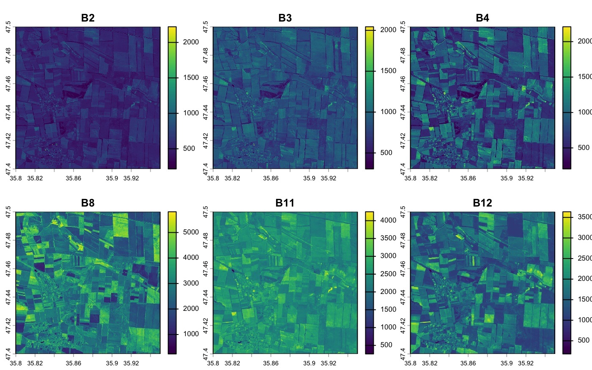
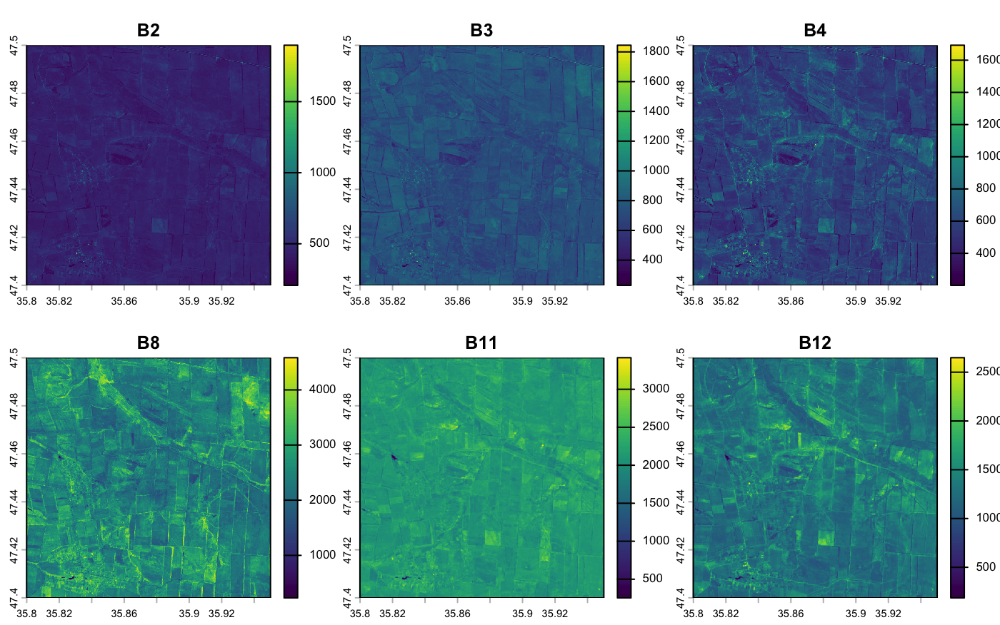
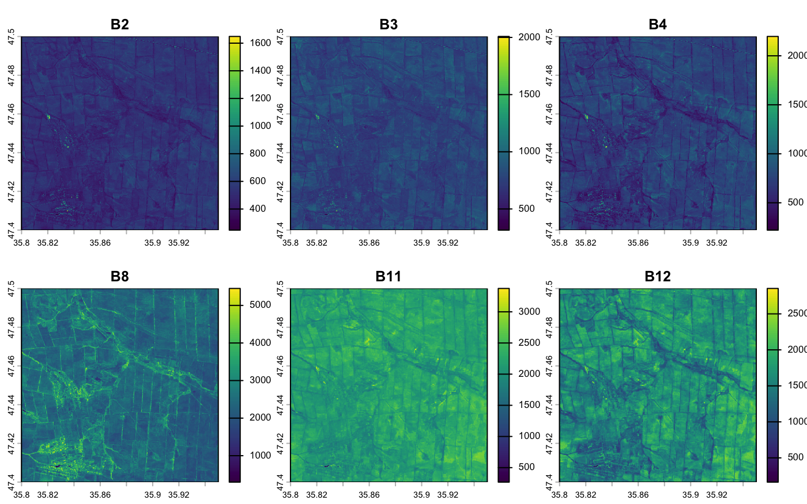
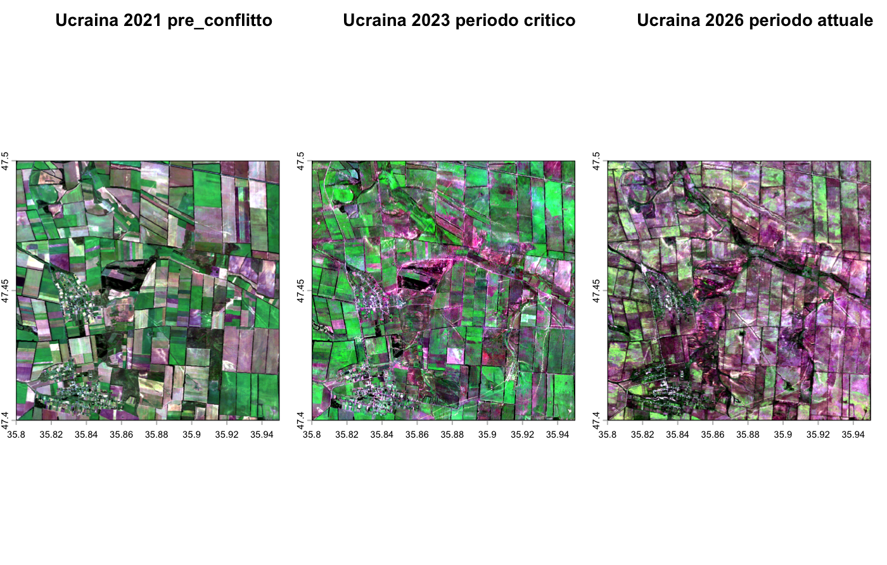

> ### esame di telerilevamneto geo-Ecologico in R 2026
> > Benito De Gennaro mat. 1218365

# Analisi tramite telerilevamento degli effetti del conflitto armato sull'ambiente in Ucraina 🛰️       
### 🌱 Monitoraggio della salute vegetativa tramite indici spettrali
### 🗓️ Periodo di studio: 2021-2026
---
# 📕 introduzione 
cco il testo corretto:
Il progetto si propone di analizzare gli effetti ambientali del conflitto armato nella regione di **Zaporizhzhia**, area di grande importanza agricola in Ucraina, attraverso l'impiego delle immagini satellitari di Sentinel-2 (programma Copernicus); è stato possibile osservare le dinamiche di trasformazione del territorio in un arco temporale di 5 anni (2021-2026). L'analisi si è articolata in tre momenti chiave:
- **2021** (Baseline): rappresenta lo stato del territorio in condizioni di normalità, prima dell'escalation del conflitto.
- **2023** (Fase critica): evidenzia l'impatto diretto delle attività belliche sulla copertura del suolo e sulla salute della vegetazione.
- **2026** (Situazione attuale): permette di valutare il grado di ripristino dell'ecosistema o, al contrario, la persistenza dei danni ambientali nel tempo.
  


# 📌Obiettivi
L'obiettivo è quantificare l'impatto bellico non solo attraverso un'analisi qualitativa (composizioni RGB), ma mediante l'elaborazione quantitativa di indici di vegetazione (NDVI) e indici di distruzione (NBR). L'analisi multitemporale 2021-2026 permette di indagare la resilienza dell'ecosistema agrario in un'area soggetta a pressioni antropiche estreme.

# 🛠️materiali e metodi 
## Acquisizione dati 
Le imagini sono state acquisite dal portale web di [Google Earth Engine](https://earthengine.google.com/), selezionado una delle arre colpite nel conflitto.
## Caratteristiche del sensore (sentinel 2) 
Per l'analisi è stato utilizzato il satellite Sentinel-2 (programma Copernicus), scelto per le sue specifiche tecniche ottimali:
- **Risoluzione spaziale**: 10 metri nelle bande del visibile e nel NIR, essenziale per il dettaglio agrario.
- **Risoluzione temporale**: Alta frequenza di rivisitazione, ideale per serie storiche multitemporali (2021-2026).
- **Bande spettrali**: Presenza delle bande NIR e SWIR, necessarie per il calcolo preciso degli indici NDVI e NBR.


>[!NOTE]
>
> Il codice java utilizzato per l'acquisizione delle immagini e nel file codes.Js

## inzio dell'analisi tramite il sofftwer R 


````r
# Imposta la cartella di lavoro per gestire correttamente l'input e l'output dei file del progetto
setwd("~/Desktop/Progetto_ucraina.R")
#Verifica del percorso impostato: conferma la cartella di lavoro corrente
getwd()
# Elenco dei file presenti nella directory per verificare la corretta disponibilità del dataset
list.files()
````
Caricamento dei pachetti che veranno utilizzati nello stuido 
````r
library(terra)     # Per gestire i dati raster 
library(imageRy)   # Per facilitarmi il lavoro con le bande
library(ggplot2)   # Per fare i grafici
library(patchwork) # Per mettere i grafici uno accanto all'altro
library(viridis)   # Per i colori delle mappe (così si vedono bene)
library(ggridges)  # Per i grafici a cresta (belli e utili)
````
## importazione dei dati 
Carico i dati raster percepiti da Sentinel 2 ,tramite la funzione **rast** del pachetto **terra**  
````r
Ucraina_2021<-rast("Ucraina_2021_bands.tif") # dati pre-conflitto (2021)
Ucraina_2023<-rast("Ucraina_2023_bands.tif") # Dati fase intermedia (2023)
Ucraina_2026<-rast("Ucraina_2026_bands.tif") # Dati correnti (2026)
````

## verifica dei metatdati dei dati raster caricati 

Prima di procedere con l'elaborazione, interrogo i tre oggetti ````Ucraina_2021````,````Ucraina_2023````e ```` Ucraina_2026````per validare le loro proprietà spaziali e strutturali. Questo passaggio è necessario per confermare che i dati siano correttamente allineati e pronti per l'analisi comparativa. In particolare, verifico:

- **Dimensioni**:Risoluzione spaziale e numero di pixel.
- **Bande**:Numero e tipologia di bande spettrali disponibili.
- **Sistema di riferimento** Fondamentale per garantire la sovrapponibilità geografica dei layer.
- **Estensione** Coordinate dei limiti dell'area di studio.

````r
# Interrogazione degli oggetti per la verifica delle informazioni spaziali e delle proprietà
Ucraina_2021
Ucraina_2023
Ucraina_2026
````
Dall'interrogazione degli oggetti, risulta che tutti e tre i dataset presentano le medesime caratteristiche strutturali, nello specifico:
- la classe : SpatRaster
- la taglia : 1114, 1671, 6 
- la risoluzione : 8.983153e-05, 8.983153e-05
- l'estenzione : 35.79993, 35.95004, 47.39997, 47.50004
- il sistema di riferimento : WGS 84 (EPSG:4326)
- le bande : B2, B3, B4, B8, B11, B12

## Visualizzazione delle immagini 
**2021**
````r
#visualizzazione delle bande spettrali (2021)
plot(Ucraina_2021)
````


**2023**
````r
#visualizzazione delle bande spettrali (2023)
plot(Ucraina_2023)
````


**2026**
````r
#visualizzazione delle bande spettrali (2026)
plot(Ucraina_2026)
````


## Composizione in Colori Naturali (True Color)
````r
#Composizione in Colori Naturali (True Color)
im.multiframe(1,3) #divisione dell interfaccia grafica in 1 riga e tre colonne 
im.plotRGB(Ucraina_2021, r=3, g=2, b=1, title="Ucraina 2021 pre-conflitto") #Composizione spettrale nel dominio del visibile
im.plotRGB(Ucraina_2023, r=3, g=2, b=1, title="Ucraina 2023 periodo critico") #Composizione spettrale nel dominio del visibile
im.plotRGB(Ucraina_2026, r=3, g=2, b=1, title="Ucraina 2026 periodo attuale") #Composizione spettrale nel dominio del visibile
````


> La serie multitemporale analizzata consente di quantificare i processi di degradazione del suolo in funzione dell'escalation del conflitto


