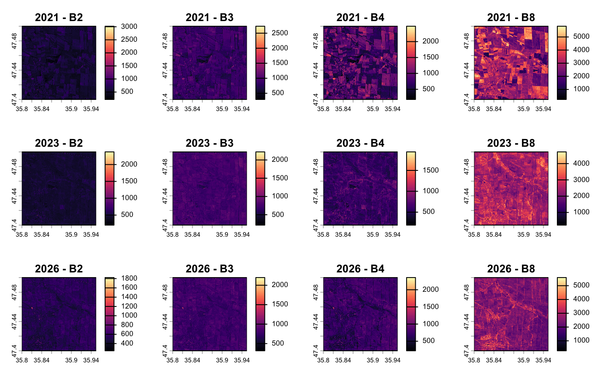
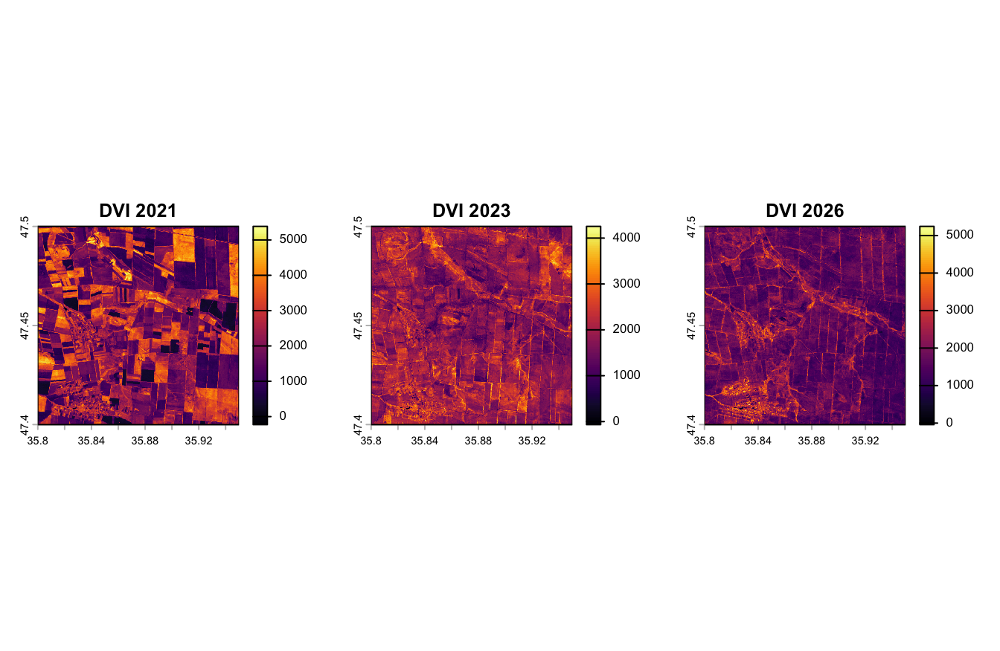

> ### esame di telerilevamneto geo-Ecologico in R 2026
> > Benito De Gennaro mat. 1218365

# Analisi tramite telerilevamento degli effetti del conflitto armato sull'ambiente in Ucraina 🛰️       
### 🌱 Monitoraggio della salute vegetativa tramite indici spettrali
### 🗓️ Periodo di studio: 2021-2026
---
# 📕 introduzione 
Il progetto si propone di analizzare gli effetti ambientali del conflitto armato nella regione di **Zaporizhzhia**, area di grande importanza agricola in Ucraina, attraverso l'impiego delle immagini satellitari di Sentinel-2 (programma Copernicus); è stato possibile osservare le dinamiche di trasformazione del territorio in un arco temporale di 5 anni (2021-2026). L'analisi si è articolata in tre momenti chiave:
- **2021** (Baseline): rappresenta lo stato del territorio in condizioni di normalità, prima dell'escalation del conflitto.
- **2023** (Fase critica): evidenzia l'impatto diretto delle attività belliche sulla copertura del suolo e sulla salute della vegetazione.
- **2026** (Situazione attuale): permette di valutare il grado di ripristino dell'ecosistema o, al contrario, la persistenza dei danni ambientali nel tempo.
  


# 📌Obiettivi
L'obiettivo è quantificare l'impatto bellico non solo attraverso un'analisi qualitativa (composizioni RGB), ma mediante l'elaborazione quantitativa di indici di vegetazione (NDVI) e Difference Vegetation Index (DVI). L'analisi multitemporale 2021-2026 permette di indagare la resilienza dell'ecosistema agrario in un'area soggetta a pressioni antropiche estreme.

# 🛠️materiali e metodi 
## Acquisizione dati 
Le imagini sono state acquisite dal portale web di [Google Earth Engine](https://earthengine.google.com/), selezionado una delle arre colpite nel conflitto.
## Caratteristiche del sensore (sentinel 2) 
Per l'analisi è stato utilizzato il satellite Sentinel-2 (programma Copernicus), scelto per le sue specifiche tecniche ottimali:
- **Risoluzione spaziale**: 10 metri nelle bande del visibile e nel NIR, essenziale per il dettaglio agrario.
- **Risoluzione temporale**: Alta frequenza di rivisitazione, ideale per serie storiche multitemporali (2021-2026).
- **Bande spettrali**: Presenza delle bande NIR e SWIR, necessarie per il calcolo preciso degli indici NDVI e NBR.

  


>[!NOTE]
>
> Il codice java utilizzato per l'acquisizione delle immagini e nel file codes.Js

## inzio dell'analisi tramite il sofftwer R 


````r
# Imposta la cartella di lavoro per gestire correttamente l'input e l'output dei file del progetto
setwd("~/Desktop/Progetto_ucraina.R")
#Verifica del percorso impostato: conferma la cartella di lavoro corrente
getwd()
# Elenco dei file presenti nella directory per verificare la corretta disponibilità del dataset
list.files()
````
Caricamento dei pachetti che veranno utilizzati nello stuido 
````r
library(terra)     # Per gestire i dati raster 
library(imageRy)   # Per facilitarmi il lavoro con le bande
library(ggplot2)   # Per fare i grafici
library(patchwork) # Per mettere i grafici uno accanto all'altro
library(viridis)   # Per i colori delle mappe (così si vedono bene)
library(ggridges)  # Per i grafici a cresta (belli e utili)
````
## importazione dei dati 
Carico i dati raster percepiti da Sentinel 2 ,tramite la funzione **rast** del pachetto **terra**  
````r
Ucraina_2021<-rast("Ucraina_2021_bands.tif") # dati pre-conflitto (2021)
Ucraina_2023<-rast("Ucraina_2023_bands.tif") # Dati fase intermedia (2023)
Ucraina_2026<-rast("Ucraina_2026_bands.tif") # Dati correnti (2026)
````

## verifica dei metatdati dei dati raster caricati 

Prima di procedere con l'elaborazione, interrogo i tre oggetti ````Ucraina_2021````,````Ucraina_2023````e ```` Ucraina_2026````per validare le loro proprietà spaziali e strutturali. Questo passaggio è necessario per confermare che i dati siano correttamente allineati e pronti per l'analisi comparativa. In particolare, verifico:

- **Dimensioni**:Risoluzione spaziale e numero di pixel.
- **Bande**:Numero e tipologia di bande spettrali disponibili.
- **Sistema di riferimento** Fondamentale per garantire la sovrapponibilità geografica dei layer.
- **Estensione** Coordinate dei limiti dell'area di studio.

````r
# Interrogazione degli oggetti per la verifica delle informazioni spaziali e delle proprietà
Ucraina_2021
Ucraina_2023
Ucraina_2026
````
Dall'interrogazione degli oggetti, risulta che tutti e tre i dataset presentano le medesime caratteristiche strutturali, nello specifico:
- la classe : SpatRaster
- la taglia : 1114, 1671, 6 
- la risoluzione : 8.983153e-05, 8.983153e-05
- l'estenzione : 35.79993, 35.95004, 47.39997, 47.50004
- il sistema di riferimento : WGS 84 (EPSG:4326)
- le bande : B2, B3, B4, B8, B11, B12

## Visualizzazione delle immagini 
**2021**
````r
#visualizzazione delle bande spettrali (2021)
plot(Ucraina_2021)
````


**2023**
````r
#visualizzazione delle bande spettrali (2023)
plot(Ucraina_2023)
````


**2026**
````r
#visualizzazione delle bande spettrali (2026)
plot(Ucraina_2026)
````


## Composizione in Colori Naturali (True Color)
````r
#Composizione in Colori Naturali (True Color)
im.multiframe(1,3) #divisione dell interfaccia grafica in 1 riga e tre colonne 
im.plotRGB(Ucraina_2021, r=3, g=2, b=1, title="Ucraina 2021 pre-conflitto") #Composizione spettrale nel dominio del visibile (2021 pre-conflitto)
im.plotRGB(Ucraina_2023, r=3, g=2, b=1, title="Ucraina 2023 periodo critico") #Composizione spettrale nel dominio del visibile (2023 fase critica)
im.plotRGB(Ucraina_2026, r=3, g=2, b=1, title="Ucraina 2026 periodo attuale") #Composizione spettrale nel dominio del visibile (2026 stato attuale)
````


> La serie multitemporale analizzata consente di quantificare i processi di degradazione del suolo in funzione dell'escalation del conflitto


````r
# chiusura dell'interfaccia grfica 
dev.off()
````
## Analisi della scomposizione spettrale multitemporale
Attraverso il confronto tra le bande del visibile (B2, B3, B4) e la banda del vicino infrarosso (B8), è possibile isolare la risposta riflettiva del suolo e della vegetazione in tre differenti fasi temporali: baseline (2021), fase critica (2023) e situazione attuale (2026).

````r
#suddivisione dell'interfaccia grafica 
im.multiframe(3, 4) 
 
# Anno 2021
plot(Ucraina_2021[[1]], col=magma(100), main="2021 - B2") # Riflettanza nel visibile (blu)
plot(Ucraina_2021[[2]], col=magma(100), main="2021 - B3") # Riflettanza nel visibile (verde)
plot(Ucraina_2021[[3]], col=magma(100), main="2021 - B4") # Riflettanza nel visibile (rosso)
plot(Ucraina_2021[[4]], col=magma(100), main="2021 - B8") # Riflettanza nel vicino infrarosso (biomassa)
 
# Anno 2023
plot(Ucraina_2023[[1]], col=magma(100), main="2023 - B2") # Riflettanza nel visibile (blu)
plot(Ucraina_2023[[2]], col=magma(100), main="2023 - B3") # Riflettanza nel visibile (verde)
plot(Ucraina_2023[[3]], col=magma(100), main="2023 - B4") # Riflettanza nel visibile (rosso)
plot(Ucraina_2023[[4]], col=magma(100), main="2023 - B8") # Riflettanza nel vicino infrarosso (biomassa)
 
# Anno 2026
plot(Ucraina_2026[[1]], col=magma(100), main="2026 - B2") # Riflettanza nel visibile (blu)
plot(Ucraina_2026[[2]], col=magma(100), main="2026 - B3") # Riflettanza nel visibile (verde)
plot(Ucraina_2026[[3]], col=magma(100), main="2026 - B4") # Riflettanza nel visibile (rosso)
plot(Ucraina_2026[[4]], col=magma(100), main="2026 - B8") # Riflettanza nel vicino infrarosso (biomassa)
````


Dall'osservazione delle immagini emerge una netta variazione nella banda NIR (B8), dove la perdita di riflettanza tra il 2021 e il 2023 evidenzia una significativa distruzione della copertura vegetale. Al contrario, le bande del visibile (B2, B3, B4) mostrano variazioni meno marcate, confermando che il degrado ambientale causato dal conflitto è identificabile con precisione solo attraverso l'analisi specifica del segnale infrarosso.

# 🌾 Calcolo degli indici vegetazionali 

## different vegetation index (DVI) 
Il DVI index viene utilizzato per valutare la presenza di vegetazione. Il DVI sfrutta la differente risposta spettrale della vegetazione nelle bande del rosso e del vicino infrarosso. Le piante sane assorbono gran parte della radiazione nella banda del rosso per i processi fotosintetici e riflettono intensamente la radiazione nel vicino infrarosso. Di conseguenza, la differenza tra queste due bande consente di stimare la presenza e la vigoria della copertura vegetale.

$` DVI = NIR - RED `$   
````r
#clacolo del DVI tramite im.dvi del pachetto ImageRy 
dvi_2021<- im.dvi(Ucraina_2021, 4,3) #calcolo dell differnt vegetation index anno 2021 
dvi_2023<- im.dvi(Ucraina_2023, 4,3) #calcolo dell differnt vegetation index anno 2023
dvi_2026<- im.dvi(Ucraina_2026, 4,3) #calcolo dell differnt vegetation index anno 2026
````
Tramite la visualizzazione delle mappe dell'indice, è possibile apprezzare la variazione temporale della biomassa e identificare chiaramente le aree colpite dal degrado ambientale

````R
im.multiframe(1,3) #suddivisione dell'interfaccia grafica in una riga e tre colonne 
#Utilizzo della palette 'inferno' per garantire una rappresentazione percettivamente uniforme e accessibile dei dati continui di DVI
plot(dvi_2021, col=inferno(100), main="DVI 2021") #visione dell' indice dvi per l'anno 2021 
plot(dvi_2023, col=inferno(100), main="DVI 2023") #visione dell' indice dvi per l'anno 2023
plot(dvi_2026, col=inferno(100), main="DVI 2026") #visione dell' indice dvi per l'anno 2026
````


Dal confronto DVI si puo osservare un progressivo e  drastico calo vigore veggetativo, rilevando una forte diminuzione di biomasaa nel 2023, processo che appare ulteriormente accentuato nel 2026

## Normalized Difference Vegetation Index (NDVI)
Si utilizza per valutare lo stato di salute e la densità di copertura vegetale. L'indice NDVI analogamente all'indice DVI sfrutta la differente risposta spettrale della vegetazione nelle bande del rosso (Red) e del vicino infrarosso (NIR). Tuttavia grazie alla normalizzazione l'NDVI assume volori compresi tra -1 e +1, facilitando il confronto tra immagini acquisite in perioodi differenzi 
$` NDVI=NIR-Red/NIR+Red `$

- valori prossimi a +1 indicano vegetazione sana e vigorosa
- valori vicino allo 0 vegetazione rada
- valori negativi generalmente sono associati

````r
#caclo del NDVI
ndvi_2021<-im.ndvi(Ucraina_2021,4,3) #NDVI anno 2021
ndvi_2023<-im.ndvi(Ucraina_2023,4,3) #NDVI anno 2023
ndvi_2026<-im.ndvi(Ucraina_2026,4,3) #NDVI anno 2026
````
La distribuzione spaziale del vigore fotosintetico calcolato viene visualizzata di seguito per facilitare il confronto multitemporale dei dati.
````r
im.multiframe(1,3) #suddivisione dell'interfaccia grafica in  1 riga e 3 colonne
#visualizzazione dei vari NDVI 
plot(ndvi_2021, col=mako(100), main="NDVI 2021") # visualizzazione NDVI 2021
plot(ndvi_2023, col=mako(100), main="NDVI 2023") # visualizzazione NDVI 2023
plot(ndvi_2026, col=mako(100), main="NDVI 2026") # visualizzazione NDVI 2026
````
Il confronto tra le tre date mostra una diminuzione dei valori dell'indice nel 2023, indicativa di una riduzione della vigoria vegetativa durante la fase più intensa del conflitto e nel 2026.


## calcolo della differeenza multitemporale dell'NDVI
Per analizzare l'evoluzione temporale dell'area di studio, viene calcolata la differenza tra NDVI, permettendo di mappare il gradiente di variazione del vigore vegetale, dove i valori negativi evidenziano i processi di degrado ambientale avvenuti negli anni selzionati 

````r
dif_23_21 <- ndvi_2023 - ndvi_2021 # Differenza tra il 2023 e il 2021
dif_26_23 <- ndvi_2026 - ndvi_2023 # Differenza tra il 2026 e il 2023
dif_26_21 <- ndvi_2026 - ndvi_2021# Differenza totale sull'intero periodo analizzato
#suddivisione dell'interfaccia grafica in una riga e tre colonne 
im.multiframe(1,3)
plot(dif_23_21, col=mako (100), main="dif_NDVI_2023-2021") #visalizzazione della differenza tra l'anno 2023 e 2021
plot(dif_26_23, col=mako (100), main="dif_NDVI_2026-2024") #visualizzazione della differenza tra l'anno 2026 e 2023
plot(dif_23_21, col=mako (100), main="dif_NDVI_2023-2021") #visualizzazione della differenza tra l'anno 2023 e 2021
````
le mappe di differeneza evidenziano un'elevata frammentazione spaziale con valori che vanno da ± 6. si osserva che un alternanza tra fasi di degrado tra il 2021 e 2023, e successiva ripresa nella fascia tra il 2023 e il 2026. Sebbene tale incremento suggerisce un fenomeno di riconolizzaizone naturale il confronto tra 2021 e 2026 confermano che il bilancio ecologico totale rimane in deficit in diversee aree del dataset.


